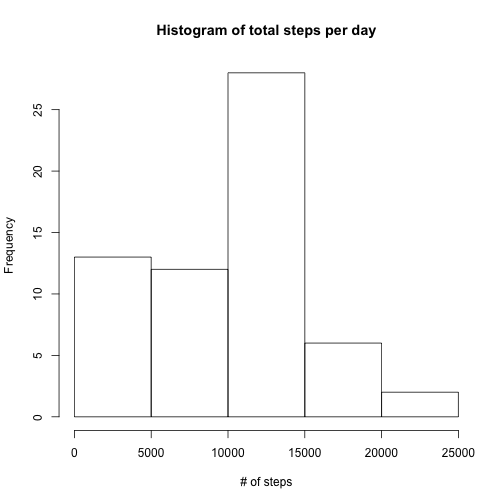
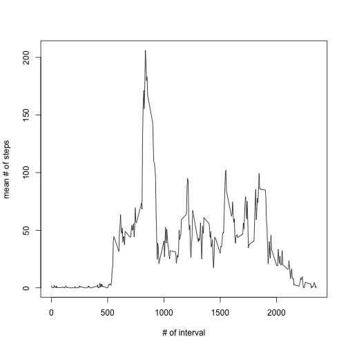
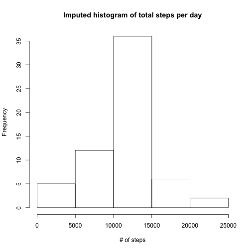
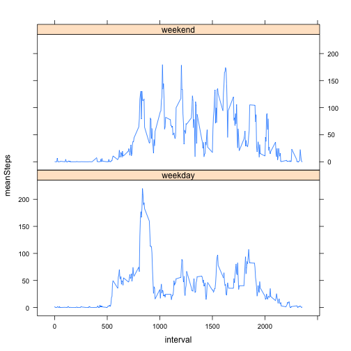

Reproducible Research Project 1
===============================


Load activity.csv dataset

```r
dat <- read.csv("activity.csv", 
                colClasses = c("numeric", "character", "integer"),
                header = TRUE)
```

Find the mean steps taken for each day

```r
dailySum <- aggregate(dat$steps,
                       by = list(dat$date),
                       FUN = sum, na.rm = TRUE)
```


Create an histogram of the total steps taken per day

```r
hist(dailySum$x, xlab = "# of steps", main = "Histogram of total steps per day")
```



```r
print(paste("mean of total # of steps taken per day:",
            as.character(mean(dailySum$x))))
```

```
## [1] "mean of total # of steps taken per day: 9354.22950819672"
```

```r
print(paste("median of total # of steps taken per day:",
            as.character(median(dailySum$x))))
```

```
## [1] "median of total # of steps taken per day: 10395"
```

Create a time series plot of the average number of steps taken in each interval
averaged across all days

```r
intervalMean <- aggregate(dat$steps,
                          by = list(dat$interval),
                          FUN = mean, na.rm = TRUE)
plot(intervalMean[,1], 
     intervalMean[,2],
     type = "l",
     xlab = "# of interval",
     ylab = "mean # of steps")
```



Report the interval with the maximun number of steps

```r
idx <- which(intervalMean[,2] == max(intervalMean[,2]))
maxAvgInterval <- intervalMean[idx,1]
print(paste("The interval with the maximum average # of steps:",
            as.character(maxAvgInterval)))
```

```
## [1] "The interval with the maximum average # of steps: 835"
```

Calculate and report the total number of missing values in the dataset

```r
totalNumOfNA <- sum(is.na(dat$steps))
print(paste("The total # of NA's in the dataset:",
            as.character(totalNumOfNA)))
```

```
## [1] "The total # of NA's in the dataset: 2304"
```

Impute the NA's with the mean number of steps for that interval

```r
idx <- which(is.na(dat$steps), arr.ind = TRUE)
imputedDat <- dat
for(i in idx){
        imputedDat$steps[i] <- intervalMean[intervalMean[,1] == imputedDat$interval[i],2]
}
```

Make an histogram of the imputed number of steps

```r
imputedDailySum <- aggregate(imputedDat$steps,
                      by = list(imputedDat$date),
                      FUN = sum)

print(paste("mean of imputed total # of steps taken per day:",
            as.character(mean(imputedDailySum$x))))
```

```
## [1] "mean of imputed total # of steps taken per day: 10766.1886792453"
```

```r
print(paste("median of imputed total # of steps taken per day:",
            as.character(median(imputedDailySum$x))))
```

```
## [1] "median of imputed total # of steps taken per day: 10766.1886792453"
```

```r
hist(imputedDailySum$x,
     xlab = "# of steps",
     main = "Imputed histogram of total steps per day")
```



  Imputing the missing value with the mean of steps taken per interval
shows that the number of steps taken per day distributes normally
where the mean equals the median.

Create a new factor variable in the dataset with two levels – 
“weekday” and “weekend” indicating whether a given date is a weekday or weekend day

```r
imputedDat$date <- as.Date(imputedDat$date,"%Y-%m-%d")
imputedDat$dayType[weekdays(imputedDat$date) == "Sunday" | 
                            weekdays(imputedDat$date) == "Sunday" ] <- "weekend"
imputedDat$dayType[!(weekdays(imputedDat$date) == "Sunday" |                                                      weekdays(imputedDat$date) == "Sunday") ] <- "weekday"
```

Make a panel plot containing a time series plot of the 5-minute interval and the average number of steps taken, averaged across all weekday days or weekend days (y-axis)


```r
meanIntervalPerDayType <- aggregate(imputedDat$steps,
                                    by = list(imputedDat$dayType,  imputedDat$interval),
                                    FUN = mean)
```

Format dayType as factor

```r
imputedDat$dayType <- as.factor(imputedDat$dayType)
names(meanIntervalPerDayType) <- c("dayType", "interval", "meanSteps")
meanIntervalPerDayType$dayType <- as.factor(meanIntervalPerDayType$dayType) 
```

plot the formalized data using lattice

```r
library(lattice)
p1 <- xyplot(meanSteps ~ interval | dayType,
             meanIntervalPerDayType,
             type = "l",
             layout = c(1,2))
print(p1)
```




